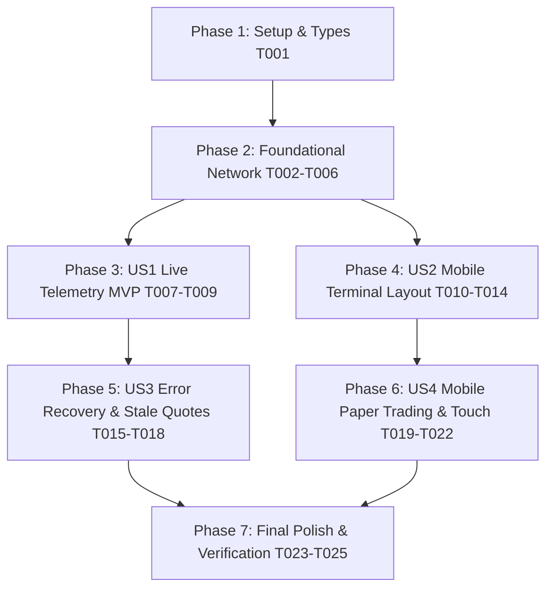

# Implementation Tasks: Production Data Reliability & Mobile Responsive UX

**Feature**: Production Data Reliability & Mobile Responsive UX
**Branch**: `001-prod-reliability-mobile-ux`
**Specification**: [specs/001-prod-reliability-mobile-ux/spec.md](spec.md)
**Implementation Plan**: [specs/001-prod-reliability-mobile-ux/plan.md](plan.md)

---

## Phase 1: Setup & Core Contracts

**Purpose**: Define the typed API response and error contracts required across serverless routes and client terminal components.

- [X] T001 Define `ApiErrorResponse`, `ApiResponse<T>`, and `StaleQuoteState` in `src/core/types.ts`

---

## Phase 2: Foundational (Resilient Network Layer & Route Contracts)

**Purpose**: Build the multi-endpoint fallback client for Binance and update serverless API routes to return typed error contracts without masking failures with synthetic zeros.

**⚠️ CRITICAL**: No user story UI work can begin until this foundational network layer is in place.

- [X] T002 [P] Create unit test suite for multi-endpoint fallback, request timeouts, and zero-synthetic prevention in `src/__tests__/binance-resilience.test.ts`
- [X] T003 Implement `fetchBinanceWithFallback` in `src/core/data/binance.ts` prioritizing `https://data-api.binance.vision`, with fallback to `api1-3.binance.com` and `api.binance.com`, 8s timeout, and browser User-Agent
- [X] T004 Update `getWatchlistOverview` in `src/core/data/market-feed.ts` to remove the silent `lastPrice: 0` catch block and propagate typed errors
- [X] T005 [P] Create API route contract tests verifying typed error payloads and status codes in `src/__tests__/api-error-contracts.test.ts`
- [X] T006 Update serverless routes `src/app/api/market/route.ts`, `src/app/api/candles/route.ts`, `src/app/api/signal/route.ts`, and `src/app/api/signal-model-d/route.ts` to return typed `ApiErrorResponse` on failure with HTTP 502/503/504

**Checkpoint**: Foundational network layer verified — tests in `binance-resilience.test.ts` and `api-error-contracts.test.ts` pass.

---

## Phase 3: User Story 1 - Live Market Telemetry & Anti-Stall Terminal (Priority: P1) 🎯 MVP

**Goal**: Deliver reliable real-time tickers, candlesticks, and quantitative signals on production (Vercel) without `$0.0000` values, blank chart canvases, or infinite spinners.

**Independent Test**:
- Open the production page;
- All watchlist assets display authentic prices (no `$0.0000`);
- The TradingView chart renders historical candles;
- The Signal Dossier resolves into a verified signal without hanging in loading.

### Implementation for User Story 1

- [X] T007 [P] [US1] Refactor state in `src/app/page.tsx` to decouple `loading` from `error` and track `watchlistError`, `candlesError`, `signalError`, and `isWatchlistStale` independently
- [X] T008 [US1] Wire error propagation and retry callbacks (`fetchMarketOverview`, `fetchCandles`, `fetchSignal`) into child component props in `src/app/page.tsx`
- [X] T009 [US1] Run automated test suite (`npm test`) to verify all 34 existing tests plus new resilience tests pass without regressions

**Checkpoint**: At this point, User Story 1 (MVP) is fully functional and testable independently.

---

## Phase 4: User Story 2 - Mobile-Responsive Trading Terminal Layout (Priority: P2)

**Goal**: Provide an ergonomic mobile terminal interface on viewports < 1024px with a segmented switcher ("График" / "Пары" / "Сигнал"), auto-switch to "График" when selecting a pair, `ResizeObserver` for the chart, and complete preservation of the desktop 3-column layout on >= 1024px.

**Independent Test**:
- Emulate mobile viewport (375px–430px);
- Segmented switcher renders and allows 1-tap switching between Chart, Watchlist, and Signal Dossier;
- Selecting an asset in "Пары" updates `selectedSymbol` and automatically switches view to "График";
- On screens >= 1024px, the full 3-column layout is permanently visible with zero layout regressions.

### Implementation for User Story 2

- [X] T010 [P] [US2] Create unit/component tests in `src/__tests__/mobile-terminal.test.ts` verifying mobile segmented tab switching and auto-focus behavior
- [X] T011 [US2] Implement the mobile segmented switcher (`[ График ] [ Пары ] [ Сигнал ]`) in `src/app/page.tsx`, visible on `< lg` (< 1024px) and displaying strictly one primary section full-screen at a time
- [X] T012 [US2] Implement auto-focus logic in `src/app/page.tsx`: when an asset is selected in the mobile "Пары" view, update `selectedSymbol` and immediately switch the active mobile section to "График"
- [X] T013 [US2] Preserve the desktop 3-column layout in `src/app/page.tsx` on `lg:` viewports (`>= 1024px`), hiding the segmented switcher and keeping Watchlist, Chart, and Dossier side-by-side
- [X] T014 [US2] Refactor `src/components/terminal/TradingViewChart.tsx` to replace `window.addEventListener("resize")` with `ResizeObserver` on `chartContainerRef` for dynamic canvas resizing on mobile rotation and tab switching

**Checkpoint**: User Stories 1 AND 2 are both functional and testable independently.

---

## Phase 5: User Story 3 - Transparent Upstream Failure Notification & Self-Healing (Priority: P3)

**Goal**: Display transparent, actionable error states with retry actions when upstream endpoints experience outages, while preserving the last verified real prices (stale quotes) with a status indicator instead of zeroing data.

**Independent Test**:
- Disconnect internet or block upstream endpoints;
- Watchlist retains last real quotes with amber "Обновление..." indicator and manual refresh button;
- Signal Dossier renders an Error State card with "Повторить анализ" instead of an infinite loading spinner;
- Chart renders an error overlay with a "Повторить загрузку" button.

### Implementation for User Story 3

- [X] T015 [P] [US3] Create tests for stale quote preservation and UI error state recovery in `src/__tests__/error-recovery.test.ts`
- [X] T016 [US3] Update `src/components/terminal/Watchlist.tsx` to retain previous real prices during transient errors, displaying an amber stale indicator ("Данные от [время] — обновление...") and manual retry trigger
- [X] T017 [US3] Fix `src/components/terminal/SignalDossier.tsx` by replacing the `loading || !signal` infinite spinner with a dedicated Error State card and "Повторить анализ" action
- [X] T018 [US3] Update `src/components/terminal/TradingViewChart.tsx` to render an error overlay with a "Повторить загрузку свечей" action when candle fetching fails

**Checkpoint**: User Stories 1, 2, and 3 are all independently functional and testable.

---

## Phase 6: User Story 4 - Mobile Paper Trading, Model D & Touch Accessibility (Priority: P4)

**Goal**: Ensure Paper Trading, Model D telemetry, and Backtest views are usable on mobile devices, with isolated horizontal scroll for wide tables, mobile-compact header navigation, and touch-accessible tap targets (>= 44×44px).

**Independent Test**:
- Navigate to "Model D Демо-торговля" and "Бэктест стратегий" on a 375px mobile viewport;
- Header tabs collapse gracefully without horizontal page overflow;
- 10-column position tables scroll smoothly inside their container without expanding root document width;
- All buttons and selectors meet minimum 44×44px touch guidelines.

### Implementation for User Story 4

- [X] T019 [P] [US4] Update `src/components/layout/Header.tsx` to provide compact navigation tabs on screens `< 768px` (icon + badge) and prevent horizontal header blowout
- [X] T020 [US4] Update `src/components/paper/PaperTradingView.tsx` to wrap active positions and trade history tables in isolated `overflow-x-auto` containers and ensure Model D telemetry scales on 360px screens
- [X] T021 [P] [US4] Update `src/components/backtest/BacktestView.tsx` to wrap trade log tables in isolated `overflow-x-auto` containers
- [X] T022 [US4] Ensure all interactive buttons, timeframe chips, and watchlist items in `src/components/terminal/TradingViewChart.tsx` and `src/components/terminal/Watchlist.tsx` have minimum 44×44px tap targets or equivalent padding

**Checkpoint**: All user stories (US1 through US4) are functional on mobile and desktop.

---

## Phase 7: Polish & Verification

**Purpose**: Cross-cutting verification, regression testing, and build validation across all viewports.

- [X] T023 [P] Execute full Vitest test suite (`npm test`) and ensure 100% of unit and integration tests pass
- [X] T024 [P] Execute production build (`npm run build`) and ensure zero TypeScript errors or Next.js packaging warnings
- [X] T025 Verify responsive page viewport on mobile emulators (375px, 393px, 412px) ensuring `document.documentElement.scrollWidth === window.innerWidth` (0px horizontal overflow)

---

## Dependencies & Execution Order

### Phase Dependencies

### User Story Dependencies

- **User Story 1 (P1 - MVP)**: Depends on Phase 2 (Foundational). Can be built and validated completely independently of mobile layout changes.
- **User Story 2 (P2 - Mobile Layout)**: Depends on Phase 2 (Foundational) and integrates with page state from US1.
- **User Story 3 (P3 - Error Recovery)**: Enhances components from US1 (Watchlist, Chart, Signal Dossier) with error UI and stale quote caching.
- **User Story 4 (P4 - Paper Trading & Touch)**: Enhances secondary views (Header, PaperTradingView, BacktestView) independently of the main terminal flow.

### Parallel Execution Opportunities

1. **Phase 2**:
   - `T002` (`binance-resilience.test.ts`) and `T005` (`api-error-contracts.test.ts`) can be written in parallel.
2. **Phase 4**:
   - `T010` (`mobile-terminal.test.ts`) and `T014` (`ResizeObserver` in `TradingViewChart.tsx`) can run in parallel.
3. **Phase 5**:
   - `T015` (`error-recovery.test.ts`), `T016` (`Watchlist.tsx`), and `T017` (`SignalDossier.tsx`) can be edited concurrently.
4. **Phase 6**:
   - `T019` (`Header.tsx`), `T020` (`PaperTradingView.tsx`), and `T021` (`BacktestView.tsx`) touch distinct files and can run in parallel.
5. **Phase 7**:
   - `T023` (`npm test`) and `T024` (`npm run build`) can run independently.

---

## Implementation Strategy: Incremental Delivery

1. **Step 1 (Foundational & Core Stability)**:
   Implement T001–T006. Ensures the serverless backend reliably reaches Binance without blocking or dummy zeroing.
2. **Step 2 (MVP - User Story 1)**:
   Implement T007–T009. The platform immediately works on production without `$0.0000`, empty charts, or stuck spinners.
3. **Step 3 (Mobile Experience - User Story 2)**:
   Implement T010–T014. The terminal becomes fully operable on smartphones with the segmented switcher and auto-tab switch.
4. **Step 4 (Fault Tolerance - User Story 3)**:
   Implement T015–T018. Enhances reliability during temporary network blips with stale quotes and retry cards.
5. **Step 5 (Full Polish - User Story 4 & Final Verification)**:
   Implement T019–T025. Mobile-compact header, horizontal scroll on tables, touch sizing, and final test/build verification.
