# Tasks: Multi-Year Model D Research & Validation

**Input**: Design documents from `/specs/003-multiyear-model-d-validation/`
- Spec: [spec.md](file:///Users/itsnegmatov/Documents/CryptoPilot%20AI/specs/003-multiyear-model-d-validation/spec.md)
- Plan: [plan.md](file:///Users/itsnegmatov/Documents/CryptoPilot%20AI/specs/003-multiyear-model-d-validation/plan.md)
- Research: [research.md](file:///Users/itsnegmatov/Documents/CryptoPilot%20AI/specs/003-multiyear-model-d-validation/research.md)
- Data Model: [data-model.md](file:///Users/itsnegmatov/Documents/CryptoPilot%20AI/specs/003-multiyear-model-d-validation/data-model.md)
- Contracts: [research-api.ts](file:///Users/itsnegmatov/Documents/CryptoPilot%20AI/specs/003-multiyear-model-d-validation/contracts/research-api.ts)

**Organization**: Tasks are strictly grouped by sequential phases and research lifecycle boundaries.

## Strict Research Lifecycle Governance
```
Phase 1 (Data Ingest & Split) 
      └──> Phase 2 (Causal Simulation & Lookahead Tests)
            └──> Phase 3 (Dev & Validation Analysis)
                  └──> 🛑 FREEZE PIPELINE CHECKPOINT (No logic/parameter tuning allowed)
                        └──> Phase 4 (Final OOS Evaluation & Monte Carlo)
                              └──> Phase 5 (Synthesis Report & Verification)
```

---

## Phase 1: Setup & Data Ingestion (Shared Infrastructure)

**Purpose**: Prepare research data layer, git exclusions, and authentic Binance dataset ingestion.

- [ ] T001 Verify `.gitignore` contains `data/historical/*.csv` to keep raw datasets out of git history.
- [ ] T002 Create isolated research types in `src/research/types.ts` reflecting `RawHistoricalCandle`, `ResearchConfig`, `ResearchTrade`, `ResearchSummary`, `MarketRegimeClassification`.
- [ ] T003 Implement Binance historical archive downloader in `src/research/data/downloader.ts` (fetching monthly 4H kline ZIPs from `data.binance.vision` with REST pagination fallback).
- [ ] T004 Implement CSV loader and dataset integrity validator in `src/research/data/loader.ts` (asserting monotonicity, \(\Delta t = 14\,400\,000\) ms, duplicate rejection, and OHLC price invariants \(L \le O, C \le H\)).
- [ ] T005 Implement chronological dataset partitioner in `src/research/data/splitter.ts` (Dev: 2021-01-01 to 2023-06-30 [50%], Validation: 2023-07-01 to 2024-09-30 [25%], OOS: 2024-10-01 to present [25%]).
- [ ] T006 Implement data manifest generator in `src/research/data/manifest.ts` creating `data/historical/manifest.json` with SHA-256 checksums, candle counts, date ranges, and source archive metadata.
- [ ] T007 Implement data ingestion CLI driver in `src/research/cli/ingest.ts` to fetch and validate `BTCUSDT`, `ETHUSDT`, and `SOLUSDT` (2021–2026).

**Checkpoint**: Raw multi-year datasets verified in `data/historical/`, manifest.json generated, zero git contamination.

---

## Phase 2: Causal Simulation Engine & Lookahead Audit (Priority: P1) 🎯 MVP

**Goal**: Implement point-in-time simulation guaranteeing zero future-leakage, using only pure mathematical indicator calculations (`src/core/quant/indicators.ts`) without importing production trading/paper logic.

- [ ] T008 Implement 5-bar structural swing trailing stop evaluator in `src/research/simulation/trailing.ts` (Long ratchet: \(\min(\text{Low}_{T-5} \dots \text{Low}_{T-1})\); Short ratchet: \(\max(\text{High}_{T-5} \dots \text{High}_{T-1})\)).
- [ ] T009 Implement causal point-in-time Model D simulator in `src/research/simulation/engine.ts`:
  - Primary Official Baseline: **LONG-ONLY** (Macro Gate: `Close > EMA200`, Trend: `EMA20 > EMA50`, Pullback: `Low <= EMA20` and `Close > EMA20`, Stop: \(2.5 \times \text{ATR14}\), 1% risk per trade).
  - Secondary Comparison Mode: **LONG + SHORT** (isolated execution, separate statistics).
  - Strict execution rule: decision on closed bar \(T-1\), fill executed at bar \(T\) Open.
- [ ] T010 Implement standard benchmark simulators in `src/research/simulation/benchmarks.ts`:
  - Buy & Hold benchmark.
  - EMA 20/50 Dual Trend benchmark (`EMA20 > EMA50` Long, flat otherwise).
- [ ] T011 Write automated lookahead audit and invariant tests in `src/__tests__/research-model-d.test.ts`:
  - Assert zero bar \(T\) leakage into signal decisions.
  - Assert trailing stop strictly uses bars \(T-5 \dots T-1\) and never current forming bar \(T\).
  - Assert indicator causality (EMA/ATR on truncated history matches full history at identical timestamp).

**Checkpoint**: Causal simulator operational, automated lookahead tests 100% passing.

---

## Phase 3: Analytics, Regimes & Stress Testing (In-Sample & Validation)

**Goal**: Implement comprehensive quantitative metrics, market regime attribution, and stress matrix for In-Sample (Dev) and Validation partitions.

- [x] T012 Implement quantitative performance metrics in `src/research/analytics/metrics.ts` (CAGR, Sharpe, Sortino, Calmar, MaxDD, Expectancy, Payoff ratio, win/loss streaks, outlier contribution).
- [x] T013 Implement market regime classification engine in `src/research/analytics/regime.ts` (Bull, Bear, Sideways/Chop, High-Volatility, Low-Volatility).
- [x] T014 Implement execution cost sensitivity matrix in `src/research/analytics/stress.ts`:
  - Baseline (0.10% round-trip)
  - Adverse / High Slippage (0.175% round-trip)
  - Severe Stress (0.30% round-trip)
- [x] T015 Implement parameter neighborhood stability analysis in `src/research/analytics/stress.ts` (ATR multiplier \([2.0, 2.25, 2.5, 2.75, 3.0]\), trailing window \([3, 4, 5, 6, 7]\)).
- [x] T016 Run simulation across In-Sample (Dev) and Validation partitions for `BTCUSDT`, `ETHUSDT`, `SOLUSDT` and record intermediate telemetry.

---

## 🛑 PIPELINE FREEZE CHECKPOINT (Mandatory Governance Gate)

**CRITICAL REQUIREMENT**:
- Strategy parameters, simulation engine code, and metric formulas are **STRICTLY FROZEN**.
- No modification to Model D rules, indicators, or parameters based on prior runs.
- User authorization to unseal Final Out-of-Sample (OOS) holdout.

---

## Phase 4: Final Out-of-Sample (OOS) & Monte Carlo Simulation

**Goal**: Evaluate Model D against the untouched Final OOS partition (2024-10-01 to Present) and run 5,000-run Monte Carlo sequence stress testing.

- [x] T017 Unseal and execute Final OOS simulation for `BTCUSDT`, `ETHUSDT`, `SOLUSDT` under frozen baseline.
- [x] T018 Implement Monte Carlo trade sequence resampling engine in `src/research/analytics/monte-carlo.ts` (5,000 iterations with replacement, computing median, 95% VaR, 99% VaR max drawdown, and probability of negative return).
- [x] T019 Run Monte Carlo stress test across full multi-year trade series for each asset.

---

## Phase 5: Synthesis Report & Final Verification

**Goal**: Compile the definitive research report answering all 10 core questions and verify system-wide integrity.

- [x] T020 Implement markdown report compiler in `src/research/reports/generator.ts`.
- [x] T021 Execute full multi-year validation suite CLI (`src/research/cli/run-validation.ts`) and compile `research/reports/model_d_multiyear_validation.md`:
  - Individual reports for `BTCUSDT`, `ETHUSDT`, `SOLUSDT`.
  - Consolidated multi-year summary.
  - Long-Only official baseline vs Long+Short secondary comparison.
  - Explicit objective answers to questions 1–10.
- [x] T022 Run `npm test` to confirm all 12 existing test suites (64 tests) and new research tests pass.
- [x] T023 Run `npm run build` to confirm production Next.js build succeeds with zero errors.
- [x] T024 Perform `git diff -- src/core src/components src/app` to confirm 100% zero changes to production code.

---

## Dependency Graph & Execution Order

```mermaid
flowchart TD
    T001["T001: .gitignore validation"] --> T002["T002: Research Types"]
    T002 --> T003["T003: Binance Downloader"]
    T003 --> T004["T004: CSV Loader & Integrity Validator"]
    T004 --> T005["T005: Chronological Splitter"]
    T005 --> T006["T006: Manifest Generator"]
    T006 --> T007["T007: Ingestion CLI"]
    
    T007 --> T008["T008: 5-bar Trailing Evaluator"]
    T008 --> T009["T009: Causal Model D Simulator"]
    T009 --> T010["T010: Benchmark Simulators"]
    T010 --> T011["T011: Lookahead Audit Unit Tests"]
    
    T011 --> T012["T012: Quantitative Metrics"]
    T012 --> T013["T013: Market Regime Classifier"]
    T013 --> T014["T014: Cost Sensitivity Matrix"]
    T014 --> T015["T015: Parameter Neighborhood Analysis"]
    T015 --> T016["T016: In-Sample & Validation Evaluation"]
    
    T016 --> FREEZE["🛑 PIPELINE FREEZE GATE"]
    
    FREEZE --> T017["T017: Final OOS Execution"]
    T017 --> T018["T018: Monte Carlo Resampling Engine"]
    T018 --> T019["T019: Monte Carlo Stress Runs"]
    
    T019 --> T020["T020: Report Generator"]
    T020 --> T021["T021: Multi-Year Research Report"]
    T021 --> T022["T022: Run npm test"]
    T022 --> T023["T023: Run npm run build"]
    T023 --> T024["T024: Verify git diff on production code"]
```


